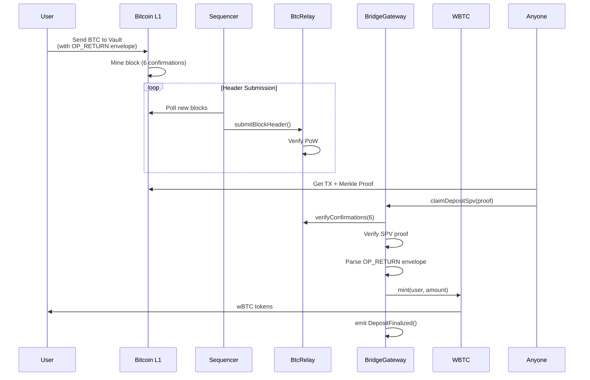
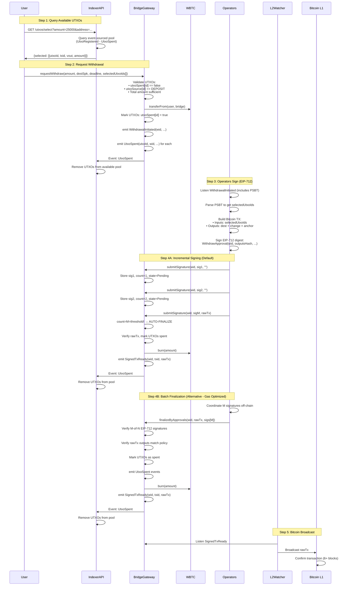

# Mojave Bridge Architecture (Event-Sourced UTXO Tracking)

## Overview

The Mojave Bridge is a trustless Bitcoin ↔ Mojave L2 bridge that enables bidirectional asset transfers using:
- **Deposits**: SPV proofs for trustless Bitcoin → Mojave L2 transfers
- **Withdrawals**: M-of-N operator multisig with EIP-712 signatures
- **UTXO Tracking**: Event-sourced architecture

**On-Chain State (Minimal)**:
- `mapping(bytes32 => bool) utxoSpent` - Only spent status
- `mapping(bytes32 => UtxoSource) utxoSource` - Only UTXO origin (DEPOSIT/COLLATERAL)

**Off-Chain State (Indexer API)**:
- Full UTXO details: txid, vout, amount, scriptPubKey
- Balance tracking per address
- UTXO selection algorithms (LARGEST_FIRST, etc.)

## System Components

```
┌──────────────────────────────────────────────────────────────────┐
│                         Bitcoin L1 Network                       │
│  ┌───────────────┐         ┌───────────────┐                     │
│  │ User's Wallet │────────▶│ Vault Address │                     │
│  │  (Deposit)    │         │  (Multisig)   │                     │
│  └───────────────┘         └───────────────┘                     │
│         │                         │                              │
│         │ OP_RETURN               │ Physical UTXO Pool           │
│         │ (Envelope)              │                              │
│         ▼                         ▼                              │
│  ┌─────────────────────────────────────────┐                     │
│  │     Bitcoin Blockchain (Headers)        │                     │
│  └─────────────────────────────────────────┘                     │
└──────────────────────────────────────────────────────────────────┘
                           │
                           │ Header Submission
                           │ (Sequencer)
                           ▼
┌──────────────────────────────────────────────────────────────────┐
│                      Mojave L2 (EVM Chain)                       │
│  ┌───────────────────────────────────────────────────────────┐   │
│  │                Smart Contracts (Minimal State)            │   │
│  │  ┌────────────┐  ┌───────────────┐  ┌────────────────┐    │   │
│  │  │  BtcRelay  │  │ BridgeGateway │  │      WBTC      │    │   │
│  │  │  (Headers) │  │   (Logic)     │  │  (ERC20 Token) │    │   │
│  │  │            │  │ • utxoSpent   │  │                │    │   │
│  │  │            │  │ • utxoSource  │  │                │    │   │
│  │  └────────────┘  └───────────────┘  └────────────────┘    │   │
│  │                          │                                │   │
│  │                          │ Events:                        │   │
│  │                          │ • UtxoRegistered               │   │
│  │                          │ • UtxoSpent                    │   │
│  └──────────────────────────┼────────────────────────────────┘   │
│                             │                                    │
│  ┌──────────────────────────┼────────────────────────────────┐   │
│  │   Off-Chain Indexer API (Event-Sourced State)             │   │
│  │                          │                                │   │
│  │   Listens to: ───────────┘                                │   │
│  │   • UtxoRegistered → Add to pool                          │   │
│  │   • UtxoSpent → Remove from pool                          │   │
│  │                                                           │   │
│  │   Provides APIs:                                          │   │
│  │   • GET /utxos/:address                                   │   │
│  │   • POST /utxos/select                                    │   │
│  │   • GET /balance/:address                                 │   │
│  └───────────────────────────────────────────────────────────┘   │
│                             │                                    │
│         ┌───────────────────┼─────────────────┐                  │
│         │                   │                 │                  │
│         ▼                   ▼                 ▼                  │
│  ┌──────────┐      ┌──────────────┐   ┌──────────┐               │
│  │  User    │      │  Operators   │   │L2-Watcher│               │
│  │  (DApp)  │      │ (M-of-N Sig) │   │ (Bridge) │               │
│  └──────────┘      └──────────────┘   └──────────┘               │
└──────────────────────────────────────────────────────────────────┘
                           │
                           │ Broadcast Signed TX
                           ▼
                    Bitcoin L1 Network
```

## Deposit Flow (Bitcoin L1 → Mojave L2)



### Steps:

1. **User sends Bitcoin** to vault address with OP_RETURN envelope containing:
   - Tag (4 bytes)
   - Chain ID (32 bytes)
   - Bridge address (20 bytes)
   - Recipient address (20 bytes)
   - Amount (32 bytes)

2. **Bitcoin network** mines the transaction and produces 6+ confirmations

3. **Sequencer** (liveness component) continuously:
   - Polls Bitcoin network for new blocks
   - Submits headers to `BtcRelay` contract
   - BtcRelay verifies PoW and stores headers

4. **Anyone** (user or relayer) can claim the deposit:
   - Fetch raw transaction and merkle proof from Bitcoin
   - Call `claimDepositSpv()` with SPV proof
   - Contract verifies:
     - 6 confirmations via BtcRelay
     - Merkle proof validity
     - OP_RETURN envelope integrity
     - No duplicate deposit
   - Mints wBTC to recipient
   - **Registers UTXO**: Emits `UtxoRegistered(utxoId, txid, vout, amount, DEPOSIT, timestamp)`

5. **Off-chain Indexer** (event listener):
   - Listens to `UtxoRegistered` event
   - Adds UTXO to available pool
   - Updates balance for recipient address
   - Makes UTXO available for withdrawal selection via API

## Withdrawal Flow (Mojave L2 → Bitcoin L1) - Event-Sourced UTXO

### Flow (Tested & Deployed)



### Withdrawal Steps:

1. **User queries Indexer API for available UTXOs**:
   ```bash
   GET /utxos/select?amount=25000&address=0xf39Fd6e51aad88F6F4ce6aB8827279cffFb92266
   ```
   - Indexer maintains event-sourced UTXO pool (UtxoRegistered - UtxoSpent)
   - Uses LARGEST_FIRST algorithm for optimal UTXO selection
   - Returns: `{selected: [{utxoId, txid, vout, amount}]}`
   - **Gas Savings**: This query is free (off-chain), vs ~2.5M gas for on-chain UTXO iteration

2. **User requests withdrawal with selected UTXOs**:
   ```solidity
   requestWithdraw(
     amountSats,      // 25000
     destSpk,         // User's Bitcoin address scriptPubKey
     deadline,        // Unix timestamp
     selectedUtxoIds  // From indexer API (UtxoInput[] with txid, vout, amount)
   )
   ```
   - Contract validates UTXOs:
     - `utxoSpent[utxoId] == false` (not already spent)
     - `utxoSource[utxoId] == DEPOSIT` (from user deposit, not collateral)
     - `sum(utxo.amount) >= amountSats` (sufficient balance)
   - Contract locks wBTC: `transferFrom(user, bridge, amountSats)`
   - Contract **stores** selectedUtxoIds (NOT marked as spent yet!)
   - Contract constructs PSBT from selectedUtxoIds
   - Contract emits single event:
     - `WithdrawalInitiated(wid, user, signerSetId, deadline, outputsHash, psbt)`
     - Note: amountSats & destSpk are in PSBT (saves ~2K gas)
   - **Gas Cost**: ~50K gas (vs ~2.5M gas with full on-chain UTXO storage)

3. **Indexer listens to events and updates state**:
   - `WithdrawalInitiated` event received
   - Parse PSBT to extract: amountSats, destSpk, selectedUtxoIds
   - Mark UTXOs as "pending" (not available for new withdrawals, but not yet confirmed spent)
   - Wait for `UtxoSpent` event (Step 5) to confirm final spent status
   - Future withdrawal requests won't see pending UTXOs

4. **Operators (M-of-N) sign withdrawal**:
   - Listen to `WithdrawalInitiated` event
   - Parse PSBT from event to get selectedUtxoIds
   - Build Bitcoin transaction off-chain:
     - Inputs: selectedUtxoIds (from PSBT)
     - Outputs: destination + change + anchor
   - Sign EIP-712 digest:
     ```solidity
     WithdrawApproval(
       wid,          // Withdrawal ID
       outputsHash,  // Policy hash
       version,      // Policy version
       expiry,       // Signature expiry (deadline in current implementation)
       signerSetId   // Operator set ID
     )
     ```

5. **Finalization (Two Options)**:

   **Option A: Incremental Signing (Simple Coordination)**
   - Each operator independently calls `submitSignature()`:
   ```solidity
   finalizeByApprovals(
     wid,             // Withdrawal ID
     rawTx,           // Signed Bitcoin transaction
     outputsHash,     // Policy hash
     version,         // Policy version
     signerSetId,     // Operator set ID
     signerBitmap,    // Bitmap of signers (LSB = operator 0)
     sigs[],          // M EIP-712 signatures in bitmap order
     expiry           // Signature expiry
   )
   ```
   - Contract verifies:
     - M-of-N EIP-712 signatures (bitmap validation)
     - rawTx outputs match outputsHash policy
     - Withdrawal not expired (block.timestamp <= deadline)
   - Contract **marks UTXOs as spent**: `utxoSpent[utxoId] = true`
   - Contract emits `UtxoSpent(utxoId, wid, timestamp)` for each UTXO
   - Contract burns wBTC: `burn(amountSats)` (atomic burn)
   - Contract emits: `SignedTxReady(wid, user, txid, amount, rawTx)`
   - **Gas Cost**: ~150K gas (1 transaction)

   ```solidity
   // Operator 1
   submitSignature(wid, sig1, "")  // No rawTx yet
   // → signatureCount = 1, state = Pending
   
   // Operator 2
   submitSignature(wid, sig2, "")
   // → signatureCount = 2, state = Pending
   
   // Operator M (last one)
   submitSignature(wid, sigM, rawTx)  // With rawTx
   // → signatureCount = M = threshold!
   // → AUTO-FINALIZE:
   //   - state = Ready → Finalized
   //   - Mark UTXOs as spent
   //   - Burn wBTC
   //   - Emit SignedTxReady
   ```
   - Contract stores each signature: `withdrawalSignatures[wid][operator] = sig`
   - Contract tracks progress: `signatureBitmap`, `signatureCount`
   - When threshold reached AND rawTx provided → auto-finalize
   - No off-chain coordination needed, simpler operator logic

   **Option B: Batch Finalization**
   - Coordinate M-of-N signatures off-chain
   - Any party calls `finalizeByApprovals()`:
   ```solidity
   finalizeByApprovals(
     wid,             // Withdrawal ID
     rawTx,           // Signed Bitcoin transaction
     outputsHash,     // Policy hash
     version,         // Policy version
     signerSetId,     // Operator set ID
     signerBitmap,    // Bitmap of signers (LSB = operator 0)
     sigs[],          // M EIP-712 signatures in bitmap order
     expiry           // Signature expiry
   )
   ```
   - Contract verifies:
     - M-of-N EIP-712 signatures (bitmap validation)
     - rawTx outputs match outputsHash policy
     - Withdrawal not expired (block.timestamp <= deadline)
   - Contract **marks UTXOs as spent**: `utxoSpent[utxoId] = true`
   - Contract emits `UtxoSpent(utxoId, wid, timestamp)` for each UTXO
   - Contract burns wBTC: `burn(amountSats)` (atomic burn)
   - Contract emits: `SignedTxReady(wid, user, txid, amount, rawTx)`

6. **Indexer updates UTXO pool**:
   - Listens to `UtxoSpent` events (from step 5)
   - Removes UTXOs from available pool (event-sourced state update)
   - Updates balance for user address
   - Marks withdrawal as finalized in indexer database

7. **L2-Watcher (off-chain relayer)**:
   - Listens to `SignedTxReady` event
   - Extracts `rawTx` from event
   - Broadcasts to Bitcoin network
   - Monitors confirmations (6+ blocks recommended)

### Event-Sourced UTXO Benefits:

| Aspect | On-Chain Storage | Event-Sourced |
|--------|-----------------|----------------------------|
| **Gas Cost (withdrawal request)** | ~2.5M gas | ~50K gas (98% savings) |
| **UTXO Selection** | On-chain loop (expensive) | Off-chain indexer (free) |
| **Contract Size** | Grows with UTXO count | Constant (only mappings) |
| **Balance Query** | On-chain loop (slow) | Indexer API (instant) |
| **Validation** | Trustless (on-chain state) | Trustless (on-chain spent check) |
| **Scalability** | Limited by gas/block size | Unlimited (event logs) |

## Key Components

### 1. BtcRelay Contract

**Purpose**: Store and verify Bitcoin block headers on L2

**Functions**:
- `submitBlockHeader(bytes header)`: Submit new Bitcoin header
- `verifyConfirmations(bytes32 headerHash, uint256 minConf)`: Verify header has enough confirmations
- `headerMerkleRoot(bytes32 headerHash)`: Get merkle root of header

**Properties**:
- `bestHeight`: Current chain tip height
- `finalizedHeight`: Height with 6+ confirmations

### 2. BridgeGateway Contract

**Purpose**: Core bridge logic for deposits and withdrawals

**Deposit Functions**:
- `claimDepositSpv(address recipient, uint256 amount, bytes32 envelope, SpvProof proof)`: Claim deposit with SPV proof

**Withdrawal Functions**:
- `requestWithdraw(uint256 amount, bytes destSpk, uint64 deadline, UtxoInput[] utxos)`: Request withdrawal with UTXO selection
- `requestWithdrawWithFee(uint256 amount, bytes destSpk, uint256 fee, uint64 deadline, UtxoInput[] utxos)`: Request with explicit fee
- `submitSignature(bytes32 wid, bytes signature, bytes rawTx)`: Submit individual operator signature (incremental signing)
  - Stores signature on-chain: `withdrawalSignatures[wid][operator] = signature`
  - Increments counter: `signatureCount++`, updates `signatureBitmap`
  - When threshold reached + rawTx provided → auto-finalize
- `finalizeByApprovals(bytes32 wid, bytes rawTx, bytes32 outputsHash, uint32 version, uint32 signerSetId, uint256 signerBitmap, bytes[] sigs, uint64 expiry)`: Finalize with batch M-of-N signatures
  - Batch verification of all signatures at once
  - More gas-efficient than incremental (1 TX vs M TXs)
- `finalizeWithStoredSignatures(bytes32 wid, bytes rawTx)`: Finalize using signatures submitted via `submitSignature()`
  - Used when operators submit signatures without rawTx
- `getStoredSignature(bytes32 wid, address operator)`: Query signature submitted by specific operator
- `cancelWithdraw(bytes32 wid)`: Cancel pending withdrawal

**States**:
```solidity
enum WState {
    None,       // Doesn't exist
    Pending,    // Awaiting signatures (initial state after requestWithdraw)
    Ready,      // Threshold signatures collected (via submitSignature)
    Finalized,  // wBTC burned, TX ready (terminal state)
    Canceled    // Canceled and refunded
}
```

**Events**:
- `WithdrawalEvent(withdrawalId, psbt)` - recommended (unsigned tx template / PSBT)
- `WithdrawalInitiated(wid, user, amount, destSpk, ...)` - (implementation: initial request record)
- `SignatureSubmitted(withdrawalId, validator, signerIndex)` - NEW
- `WithdrawalSucceed(withdrawalId, psbt, sigs[])` - spec-preferred final success (atomic burn + emit)
- `SignedTxReady(wid, user, txid, amount, rawTx)` - current implementation's success event; equivalent to `WithdrawalSucceed` if emitted after burn
- `WithdrawalCanceled(wid, user, amount, canceledBy)`
- `DepositFinalized(did, recipient, amount, btcTxid, vout)`

### 3. WBTC Token Contract

**Purpose**: ERC20 representation of Bitcoin on L2

**Functions**:
- `mint(address to, uint256 amount)`: Mint new wBTC (called by BridgeGateway on deposit)
- `burn(uint256 amount)`: Burn wBTC (called by BridgeGateway on withdrawal)

**Properties**:
- `decimals`: 8 (matches Bitcoin satoshis)
- `totalSupply`: Reflects total BTC locked in bridge

## Security Model

### Deposit Security

**Trustless via SPV**:
- Uses Bitcoin's proof-of-work for security
- Requires 6 confirmations (reduces reorg risk to ~0.1%)
- Merkle proof verification ensures TX is in Bitcoin blockchain
- OP_RETURN envelope validation prevents unauthorized minting

**Attack Vectors & Mitigations**:
1. **Reorg Attack**: 6 confirmations required (economically infeasible)
2. **Duplicate Deposit**: Outpoint tracking prevents double-claims
3. **Fake Header**: PoW verification in BtcRelay
4. **Header Liveness**: Sequencer responsibility (see Assumptions)

### Withdrawal Security

**M-of-N Multi-signature**:
- Requires threshold signatures (e.g., 4-of-5 operators)
- EIP-712 typed signatures prevent replay attacks
- Operator set versioning allows smooth upgrades
- Signature bitmap prevents duplicate submissions

**Attack Vectors & Mitigations**:
1. **Malicious Operator**: Requires M-1 other operators to collude
2. **Stolen Key**: Can rotate operator set without interrupting service
3. **Output Manipulation**: Contract validates TX outputs match policy
4. **Fee Manipulation**: User specifies fee explicitly in requestWithdrawWithFee
5. **Change Dust**: Operators validate B ≥ dust before signing

### Assumptions

1. **Header Liveness**: Sequencer continuously submits Bitcoin headers
   - If sequencer fails: Deposits cannot be claimed (temporary DoS)
   - Mitigation: Anyone can submit headers to BtcRelay
   - Future: Decentralized header submission incentives

2. **Operator Honesty**: Less than M operators collude
   - Current: 4-of-5 threshold (80% honesty required)
   - Vault UTXOs controlled by operator multisig
   - Future: Economic security via bonding/slashing

3. **Bitcoin Network Security**: Bitcoin L1 is secure
   - 6 confirmations provide ~99.9% security
   - Historical precedent: No successful 6-block reorg in Bitcoin history

## Fee Model

### Deposit Fees
- **Bitcoin L1 Fee**: User pays when sending BTC transaction
- **L2 Gas Fee**: User or relayer pays for `claimDepositSpv()` call
- **Bridge Fee**: None (can be added via `minDepositAmount` parameter)

### Withdrawal Fees
- **L2 Gas Fee**: User pays for `requestWithdraw()` call
- **Bitcoin L1 Fee**: Included in withdrawal amount
  - Option 1: Implicit (deducted by operators)
  - Option 2: Explicit via `requestWithdrawWithFee(amount, fee)`
- **Bridge Fee**: None (can be added via protocol parameters)

## Data Structures

### Withdrawal
```solidity
struct Withdrawal {
    address user;              // L2 user address
    uint256 amountSats;        // Total amount (A + C)
    bytes destSpk;             // Bitcoin destination scriptPubKey
    uint64 deadline;           // Unix timestamp
    bytes32 outputsHash;       // Policy hash (A, B, C validation)
    uint32 version;            // Policy version
    uint32 signerSetId;        // Operator set snapshot
    WState state;              // Current state
    uint256 signatureBitmap;   // Bitmap of validators who signed
    uint256 signatureCount;    // Number of signatures collected
}
```

### Signature Storage
```solidity
// Mapping to store individual operator signatures for incremental signing
mapping(bytes32 => mapping(address => bytes)) private withdrawalSignatures;
// Usage: withdrawalSignatures[wid][operatorAddress] = signature
```

**Purpose**: 
- Stores operator signatures on-chain for incremental signing flow
- Allows auto-finalization when threshold reached
- Enables `finalizeWithStoredSignatures()` for manual finalization
- Not used in batch flow where signatures passed as function parameter

### SPV Proof
```solidity
struct SpvProof {
    bytes rawTx;               // Serialized Bitcoin transaction
    bytes32 txid;              // Witness-stripped TXID
    bytes32[] merkleBranch;    // Merkle siblings
    uint32 index;              // TX position in block
    bytes header0;             // 80-byte Bitcoin header
    bytes[] confirmHeaders;    // Additional headers (optional)
}
```

### OP_RETURN Envelope
```
Offset | Length | Field
-------|--------|------------------
0      | 4      | Tag (e.g., "MJVB")
4      | 32     | Chain ID
36     | 20     | Bridge Address
56     | 20     | Recipient Address
76     | 32     | Amount (big-endian)
-------|--------|------------------
Total: 108 bytes
```

## Configuration Parameters

### BtcRelay
- `minDifficultyBlocks`: Blocks before difficulty adjustment (2016 for mainnet)
- `difficultyAdjustmentInterval`: Time between adjustments

### BridgeGateway
- `vaultScriptPubkey`: Bitcoin address where deposits are sent
- `vaultChangeSpk`: Change output script for withdrawals
- `anchorSpk`: Small CPFP anchor output script
- `anchorRequired`: Whether anchor output is mandatory
- `opretTag`: 4-byte identifier for OP_RETURN envelopes
- `policyVersion`: Current output policy version

### Operator Set
- `members[]`: List of operator addresses
- `threshold`: M-of-N threshold (e.g., 4 of 5)
- `active`: Whether this set can sign new withdrawals

## Testing

### E2E Test Flow

The `e2e_incremental_sigs.sh` script validates the entire system with incremental signing:

```bash
# 15 Steps (Incremental Signing Flow):
[1-4]  Setup: Bitcoin regtest + Mojave L2
[5]    Submit initial Bitcoin headers (1-10)
[6-7]  Create Bitcoin deposit with OP_RETURN
[8]    Submit additional headers (11-108)
[9]    Submit SPV proof and mint wBTC
[10]   Verify wBTC balance (50,000 sats)
[11]   Request withdrawal with UTXO selection (25,000 sats)
[12]   Operator 1 submits signature (submitSignature)
[13]   Operator 2 submits signature (submitSignature)
[14]   Operator 3 submits signature (submitSignature)
[15]   Operator 4 (M-th) submits signature with rawTx → Auto-finalize and burn wBTC

Result: ✅ All tests pass
- Deposit: 50,000 sats → 50,000 wBTC minted
- Withdrawal: 25,000 sats → 25,000 wBTC burned (incremental signing, auto-finalized)
- Final: 25,000 wBTC supply

Alternative: e2e_batch_finalization.sh (batch finalization flow)
```

### Test Results
```
✓ Bitcoin headers verified with real PoW
✓ SPV proof validated  
✓ wBTC minted correctly (50000 sats)
✓ Withdrawal requested and finalized
✓ wBTC burned correctly (25000 sats)
```

## PSBT & EIP-712 Specification

### PSBT (Partially Signed Bitcoin Transaction) Template

The bridge contract should emit an unsigned transaction template (PSBT or compact representation) that validators can deterministically reconstruct and sign.

#### Compact TX Template Structure (JSON Example)

```json
{
  "withdrawalId": "0x88ee4f7a...",
  "version": 2,
  "locktime": 0,
  "inputs": [
    {
      "txid": "0xabc123...",
      "vout": 0,
      "scriptPubKey": "0x0014...",
      "amount": 100000,
      "sequence": 4294967295
    }
  ],
  "outputs": [
    {
      "index": 0,
      "scriptPubKey": "0x0014a8f2b3c4...",
      "amount": 50000,
      "label": "user_destination"
    },
    {
      "index": 1,
      "scriptPubKey": "0x0020b7e3c5d6...",
      "amount": 48000,
      "label": "vault_change"
    },
    {
      "index": 2,
      "value": 2000,
      "label": "fee"
    }
  ],
  "sighashType": "SIGHASH_ALL"
}
```

#### Output Policy Validation

```
A (user destination) = 50000 sats
B (vault change) = 48000 sats (≥ dust = 546 sats ✓)
C (fee) = 2000 sats
Total inputs = 100000 sats
A + C = 52000 sats ≤ 100000 sats ✓
```

### EIP-712 Approval Digest Specification

Validators sign an EIP-712 typed digest to approve withdrawal outputs.

#### Domain Separator

```solidity
struct EIP712Domain {
    string name;        // "BridgeGateway"
    string version;     // "1"
    uint256 chainId;    // 1729 (Mojave L2)
    address verifyingContract;  // BridgeGateway address
}
```

#### WithdrawApproval Type

```solidity
struct WithdrawApproval {
    bytes32 wid;            // Withdrawal ID
    bytes32 outputsHash;    // keccak256(abi.encode(outputs))
    uint32 version;         // Policy version
    uint64 expiry;          // Signature expiry timestamp
    uint32 signerSetId;     // Operator set snapshot ID
}
```

#### Outputs Hash Calculation

```solidity
bytes32 outputsHash = keccak256(abi.encode(
    amountSats,         // A: user destination
    keccak256(destSpk), // User's destination scriptPubKey
    changePolicyHash,   // B: vault change policy
    anchorRequired,     // Whether anchor output is included
    feeSats,            // C: fee amount
    policyVersion       // Policy version number
));
```

#### Complete Digest Construction

```solidity
bytes32 domainSeparator = keccak256(abi.encode(
    keccak256("EIP712Domain(string name,string version,uint256 chainId,address verifyingContract)"),
    keccak256("BridgeGateway"),
    keccak256("1"),
    1729,
    address(bridgeGateway)
));

bytes32 structHash = keccak256(abi.encode(
    keccak256("WithdrawApproval(bytes32 wid,bytes32 outputsHash,uint32 version,uint64 expiry,uint32 signerSetId)"),
    wid,
    outputsHash,
    version,
    expiry,
    signerSetId
));

bytes32 digest = keccak256(abi.encodePacked(
    "\x19\x01",
    domainSeparator,
    structHash
));
```

#### Example: Complete Approval Digest

```javascript
// Example values
const withdrawal = {
  wid: "0x88ee4f7a3c2b1d5e9f8a7b6c5d4e3f2a1b0c9d8e7f6a5b4c3d2e1f0a9b8c7d6e",
  outputsHash: "0xace91234abcd5678ef901234abcd5678ef901234abcd5678ef901234abcd5678",
  version: 1,
  expiry: 1764143598,
  signerSetId: 1
};

// Result
const approvalDigest = "0xbb24fbdc7e9f3c1a2d5b8e4f0a9c7d6e5b4a3c2f1e0d9c8b7a6f5e4d3c2b1a0f";
```

### Signature Verification Pseudo-code

```solidity
function verifyApprovalSignature(
    bytes32 wid,
    bytes32 outputsHash,
    bytes memory signature,
    address expectedSigner
) internal view returns (bool) {
    // 1. Reconstruct EIP-712 digest
    bytes32 digest = _approvalDigest(wid, outputsHash, version, expiry, signerSetId);
    
    // 2. Recover signer from signature
    address recoveredSigner = ECDSA.recover(digest, signature);
    
    // 3. Verify signer matches expected operator
    if (recoveredSigner != expectedSigner) {
        return false;
    }
    
    // 4. Verify signer is in current operator set
    uint256 signerIndex = operatorSetIndex[signerSetId][recoveredSigner];
    if (signerIndex == 0 && sets[signerSetId].members[0] != recoveredSigner) {
        return false;  // Not in operator set
    }
    
    // 5. Check signature hasn't expired
    if (block.timestamp > expiry) {
        return false;
    }
    
    return true;
}
```

### PSBT Reconstruction Example (Validator Client)

```javascript
// Validator listens to WithdrawalEvent(withdrawalId, psbt)
async function onWithdrawalEvent(withdrawalId, psbtBytes) {
    // 1. Parse PSBT template
    const psbt = parsePSBT(psbtBytes);
    
    // 2. Reconstruct unsigned Bitcoin transaction
    const unsignedTx = {
        version: psbt.version,
        inputs: psbt.inputs.map(inp => ({
            txid: inp.txid,
            vout: inp.vout,
            scriptSig: Buffer.alloc(0),  // Empty for signing
            sequence: inp.sequence
        })),
        outputs: psbt.outputs.map(out => ({
            scriptPubKey: out.scriptPubKey,
            value: out.amount
        })),
        locktime: psbt.locktime
    };
    
    // 3. Construct EIP-712 approval digest
    const outputsHash = calculateOutputsHash(psbt.outputs);
    const approvalDigest = constructEIP712Digest(
        withdrawalId,
        outputsHash,
        psbt.policyVersion,
        psbt.expiry,
        psbt.signerSetId
    );
    
    // 4. Sign approval digest with validator's private key
    const signature = await wallet.signMessage(approvalDigest);
    
    // 5. Submit signature on-chain (with empty rawTx for incremental, or with rawTx for auto-finalize)
    await bridgeGateway.submitSignature(withdrawalId, signature, "0x");
    
    console.log(`Signature submitted for withdrawal ${withdrawalId}`);
}
```

## L2-Watcher Service

### Role in Withdrawal Flow

The **L2-Watcher** is an off-chain service responsible for:
1. Monitoring `SignedTxReady` events from `BridgeGateway`
2. Broadcasting signed Bitcoin transactions to the Bitcoin L1 network
3. (Optional) Recording Bitcoin L1 confirmation status back to Mojave L2

## Glossary

- **SPV (Simplified Payment Verification)**: Bitcoin's light client protocol for verifying transactions without downloading the full blockchain
- **PoW (Proof of Work)**: Bitcoin's consensus mechanism based on computational difficulty
- **OP_RETURN**: Bitcoin opcode for embedding arbitrary data in transactions
- **UTXO (Unspent Transaction Output)**: Bitcoin's fundamental transaction primitive
- **Merkle Proof**: Cryptographic proof that a transaction is included in a block
- **M-of-N Multisig**: Requires M signatures from N total operators (e.g., 4-of-5)
- **EIP-712**: Ethereum standard for typed structured data hashing and signing
- **Dust Limit**: Minimum viable UTXO size (546 satoshis) to prevent blockchain bloat
- **CPFP (Child Pays For Parent)**: Bitcoin fee bumping technique using anchor outputs
- **Reorg (Reorganization)**: Temporary chain split resolved by choosing longest chain
- **Envelope**: Structured data embedded in OP_RETURN for cross-chain communication

## References

- [Bitcoin SPV](https://developer.bitcoin.org/devguide/payment_processing.html#simplified-payment-verification-spv)
- [BTC Relay](https://github.com/ethereum/btcrelay)
- [EIP-712](https://eips.ethereum.org/EIPS/eip-712)
- [Bitcoin Script](https://en.bitcoin.it/wiki/Script)
- [Merkle Trees](https://en.bitcoin.it/wiki/Protocol_documentation#Merkle_Trees)
